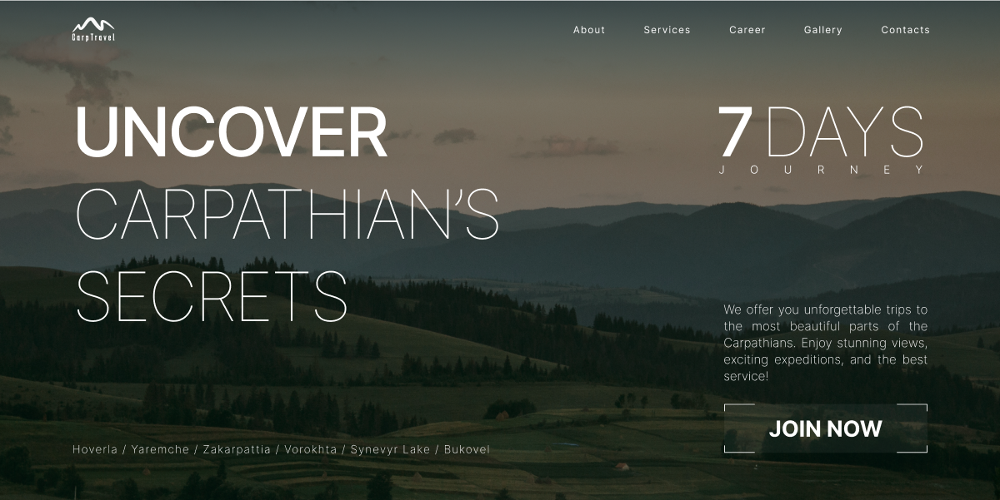

<h1 align="center">CarpTravel - advertising website</h1>

## Technologies Used

&nbsp;Next.js&nbsp; &nbsp;TypeScript&nbsp; &nbsp;tailwindcss&nbsp;

## Description

Introduce for your attention a demonstration website that presents the services of one some company for organizing your vacation in the Ukrainian Carpathians.

## Implemented in the project the following functionality

- SEO
- Site navigation
- Several sliders for the ability to watch images and main challenges during the tour
- Resource loading is optimized
- Adaptive layout
- Possibility fill out an application and send information using several forms

## Getting Started

Use this link to open the page: [CarpTravel](https://carp-travel-mauve.vercel.app/)

